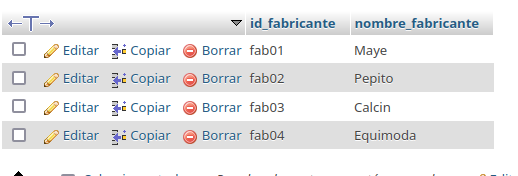
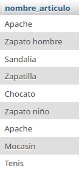
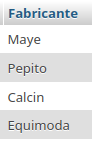
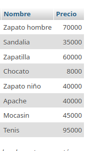
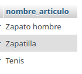

# Sistema para una zapateriateria

## Modelo de Entidad-Relacion

## Modelo Fisico de la BD

## Tabla fabricante

## Tabla Articulo

## Consultas a la BD

1. Mostrar la lista de todos los datos de los fabricantes 

`SELECT * FROM Fabricante;`

2. Mostrar la lista de los Fabricantes, poniendo un alias al nombre de la colomna

`SELECT nombre_fabricante AS Fabricante FROM Fabricante`

3. Mostrar los nombres de los productos.

`SELECT nombre_articulo FROM Articulo`

4. Obtener los nombres y los precios de los productos de la tienda.

`SELECT nombre_articulo AS Nombre, precio articulo AS Precio FROM Articulo`

5. optenerlos nombres de los articulos cuyo precio sea superior a 50000

`SELECT nombre_articulo FROM articulo, precio articulo AS Precio FROM Articulo`
